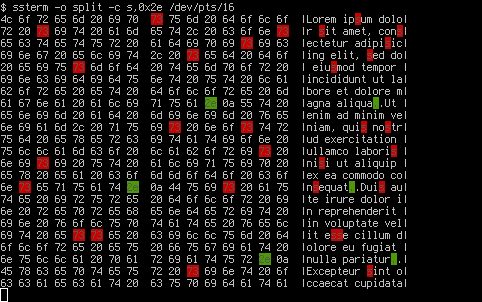
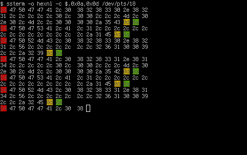

# ssterm [](https://travis-ci.org/vsergeev/ssterm) [](https://github.com/vsergeev/ssterm) [](https://github.com/vsergeev/ssterm/blob/master/LICENSE)

ssterm is a simple console-based serial port terminal featuring painless serial
port configuration, no dependencies outside of a standard Python 2 or 3
installation, and a variety of useful formatting options:

* output modes
  * raw
  * hexadecimal
  * hexadecimal/ASCII split
* input modes
  * raw
  * hexadecimal
* transmit newline remapping (e.g. system newline -> CRLF)
* receive newline remapping (e.g. CRLF -> system newline)
* character color coding
* local character echo
* output newline timestamp

## Installation

With pip:

```
pip install ssterm
```

With file:

```
wget https://github.com/vsergeev/ssterm/raw/master/ssterm.py -O ssterm
chmod +x ssterm
```

## Usage

```
Usage: ./ssterm [options] <serial port device>

ssterm - simple serial-port terminal
https://github.com/vsergeev/ssterm

Serial Port Options:
  -b, --baudrate <rate>         Specify baudrate: e.g. 9600, 115200, etc.
  -d, --databits <number>       Specify number of data bits: 5, 6, 7, 8
  -p, --parity <type>           Specify parity: none, odd, even
  -t, --stopbits <number>       Specify number of stop bits: 1, 2
  -f, --flow-control <type>     Specify flow control: none, rtscts, xonxoff

Output Formatting Options:
  -o, --output <mode>           Specify output mode
                                  raw       raw (default)
                                  split     hex./ASCII split
                                  splitfull hex./ASCII split with full lines
                                  hex       hex.
                                  hexnl     hex. with newlines

  --rx-nl <substitution>        Enable substitution of the specified newline
                                for the system's newline upon reception
                                  cr, lf, crlf, crorlf

  -c, --color <list>            Specify comma-delimited list of characters in
                                ASCII or hex. to color code: A,$,0x0d,0x0a,...
                                
  -m, --timestamp <precision>   Specify precision of timestamp for new lines
                                  n         none (default)
                                  s         seconds 
                                  m         milliseconds
                                  u         microseconds                                  

Input Formatting Options:
  -i, --input <mode>            Specify input mode
                                  raw       raw (default)
                                  hex       hex. interpretation

  --tx-nl <substitution>        Enable substitution of the system's newline
                                for the specified newline upon transmission
                                  none, cr, lf, crlf

  -e, --echo                    Enable local character echo

Miscellaneous:
  -h, --help                    Display this usage/help
  -v, --version                 Display the program's version

Quit Escape Character:          Ctrl-]

Default Options:
 baudrate: 115200 | databits: 8 | parity: none | stopbits: 1 | flowctrl: none
 output mode: raw | rx newline: raw | color code: none
 input mode: raw  | tx newline: raw | local echo: off
```

#### Defaults

ssterm opens the specified serial port with the default settings of 115200
baudrate, 8 data bits, no parity, 1 stop bit, and no flow control. These serial
port settings can be configured with the `-b, --baudrate`, `-d, --databits`,
`-p, --parity`, `-t, --stopbits`, and `-f, --flow-control` options.

Ctrl-] is ssterm's quit escape character.

#### Output Options

The `-o, --output` option selects the output mode. In the default `raw` output
mode, received characters are written directly to standard output. In `hex`
output mode, received characters are printed as hexadecimal bytes. In `hexnl`
output mode, received characters are printed as hexadecimal bytes, but newlines
are also interpreted and produce line breaks in the output. In `split` output
mode, received characters are printed in both hexadecimal and ASCII in two
columns, like hexdump's canonical output. `splitfull` output mode functions
like `split` mode, except that it only prints full lines, whereas `split` mode
redraws partial lines as additional bytes are received.

The `--rx-nl` receive newline substitution option enables substituting the
specified newline for the system newline before printing. For example, `--rx-nl
crlf` will substitute any CRLF sequence received for the system's newline (e.g.
LF on Linux) before printing. Receive newline substitution is disabled by
default.

The `-c, --color` option enables color coding the specified comma-delimited
list of characters. The list can contain ASCII characters (e.g. `a,$,A,...`),
as well as hexadecimal bytes (e.g. `0x0a,0xff,...`). Up to seven distinct
colors are assigned sequentially to the specified characters, in the order of:
(Foreground/Background) Black/Red, Black/Green, Black/Yellow, White/Blue,
White/Magenta, Black/Cyan, Black/White.

The `-m, --timestamp` option enables adding system time for new lines received
from serial port. For example, `-m m` will add time with precision milliseconds 
on a newline at the moment when new data is received after a line break.

#### Input Options

The `-i, --input` option selects the input mode. In the default `raw` input
mode, all input characters and control signals are written directly to the
serial port. In the `hex` input mode, consecutive hexadecimal pairs are
converted to bytes and written to the serial port. For example, all four
sequences `aa 55 ee ff`, `0xaa 0x55 0xee 0xff`, `AA,55,EE,FF`, `aa55eeff` will
write the same four bytes (0xaa, 0x55, 0xee, 0xff) to the serial port in the
`hex` input mode.

The `--tx-nl` transmit newline substitution option enables substituting the
system newline for the specified newline before transmission. For example,
`--tx-nl crlf` will substitute the system's newline for a CRLF sequence before
it is written to the serial port. Transmit newline substitution is disabled by
default.

The `-e, --echo` option enables local character echo. Local character echo is
disabled by default.

## Examples

Typical usage with defaults (115200 8N1, no flow control):

    $ ssterm /dev/ttyUSB0

Logging some data:

    $ ssterm /dev/ttyUSB0 > nmea_data.txt

Viewing and logging some data, with the help of tee:

    $ ssterm /dev/ttyUSB0 | tee nmea_data.txt

Piping some data to the serial port, substituting the system newline for CRLF
on transmission:

    $ cat data.txt | ssterm --tx-nl crlf /dev/ttyUSB0

Specific serial port settings (9600 baudrate, odd parity, 2 stop bits), and the
default 8 data bits:

    $ ssterm -b 9600 -p odd -t 2 /dev/ttyUSB0

Substitute the system newline for CRLF on transmission, substitute CRLF for system
newline on reception:

    $ ssterm --tx-nl crlf --rx-nl crlf /dev/ttyUSB0

Raw output mode:

    $ ssterm /dev/ttyUSB0
    $GPGGA,082830.821,,,,,0,00,,,M,0.0,M,,0000*5C
    $GPGSA,A,1,,,,,,,,,,,,,,,*1E
    $GPRMC,082830.821,V,,,,,,,261009,,*29
    $GPGGA,082831.814,,,,,0,00,,,M,0.0,M,,0000*5B
    $GPGSA,A,1,,,,,,,,,,,,,,,*1E
    $GPRMC,082831.814,V,,,,,,,261009,,*2E
    $GPGGA,08

Hexadecimal output mode:

    $ ssterm -o hex /dev/ttyUSB0
    24 47 50 47 47 41 2c 30  38 32 38 33 30 2e 38 32
    31 2c 2c 2c 2c 2c 30 2c  30 30 2c 2c 2c 4d 2c 30
    2e 30 2c 4d 2c 2c 30 30  30 30 2a 35 43 0d 0a 24
    47 50 47 53 41 2c 41 2c  31 2c 2c 2c 2c 2c 2c 2c
    2c 2c 2c 2c 2c 2c 2c 2c  2a 31 45 0d 0a 24 47 50
    52 4d 43 2c 30 38 32 38  33 30 2e 38 32 31 2c 56
    2c 2c 2c 2c 2c 2c 2c 32  36 31 30 30 39 2c 2c 2a
    32 39 0d 0a 24 47 50 47  47 41 2c 30 38 32 38 33
    31 2e 38 31 34 2c 2c 2c  2c 2c 30 2c 30 30 2c 2c
    2c 4d 2c 30 2e 30 2c 4d  2c 2c 30 30 30 30 2a 35
    42 0d 0a 24 47 50 47 53  41 2c 41 2c 31 2c 2c 2c
    2c 2c 2c 2c 2c 2c 2c 2c  2c 2c 2c 2c 2a 31 45 0d
    0a 24 47 50 52 4d 43 2c  30 38 32 38 33 31 2e 38
    31 34 2c 56 2c 2c 2c 2c  2c 2c 2c 32 36 31 30 30
    39 2c 2c 2a 32 45 0d 0a  24 47 50 47 47 41 2c 30
    38 

Split output mode:

    $ ssterm -o split /dev/ttyUSB0
    4c 6f 72 65 6d 20 69 70  73 75 6d 20 64 6f 6c 6f  |Lorem ipsum dolo|
    72 20 73 69 74 20 61 6d  65 74 2c 20 63 6f 6e 73  |r sit amet, cons|
    65 63 74 65 74 75 72 20  61 64 69 70 69 73 69 63  |ectetur adipisic|
    69 6e 67 20 65 6c 69 74  2c 20 73 65 64 20 64 6f  |ing elit, sed do|
    20 65 69 75 73 6d 6f 64  20 74 65 6d 70 6f 72 20  | eiusmod tempor |
    69 6e 63 69 64 69 64 75  6e 74 20 75 74 20 6c 61  |incididunt ut la|
    62 6f 72 65 20 65 74 20  64 6f 6c 6f 72 65 20 6d  |bore et dolore m|
    61 67 6e 61 20 61 6c 69  71 75 61 2e 0a 55 74 20  |agna aliqua..Ut |
    65 6e 69 6d 20 61 64 20  6d 69 6e 69 6d 20 76 65  |enim ad minim ve|
    6e 69 61 6d 2c 20 71 75  69 73 20 6e 6f 73 74 72  |niam, quis nostr|
    75 64 20 65 78 65 72 63  69 74 61 74 69 6f 6e 20  |ud exercitation |
    75 6c 6c 61 6d 63 6f 20  6c 61 62 6f 72 69 73 20  |ullamco laboris |
    6e 69 73 69 20 75 74 20  61 6c 69 71 75 69 70 20  |nisi ut aliquip |
    65 78 20 65 61 20 63 6f  6d 6d 6f 64 6f 20 63 6f  |ex ea commodo co|
    6e 73 65 71 75 61 74 2e  0a 44 75 69 73 20 61 75  |nsequat..Duis au|
    74 65 20 69 72 75 72 65  20 64 6f 6c 6f 72 20 69  |te irure dolor i|
    6e 20 72 65 70 72 65 68  65 6e 64 65 72 69 74 20  |n reprehenderit |
    69 6e 20 76 6f 6c 75 70  74 61 74 65 20 76 65 6c  |in voluptate vel|
    69 74 20 65 73 73 65                              |it esse         |

Split output mode and character color coding:

    $ ssterm -o split -c 0x0A,{,g,0xAE /dev/ttyUSB0



Hexadecimal with newline interpretation output mode and character color coding:

    $ ssterm -o hexnl -c $,0x0a,0x0d /dev/ttyUSB0



## LICENSE

ssterm is MIT licensed. See the included `LICENSE` file.

